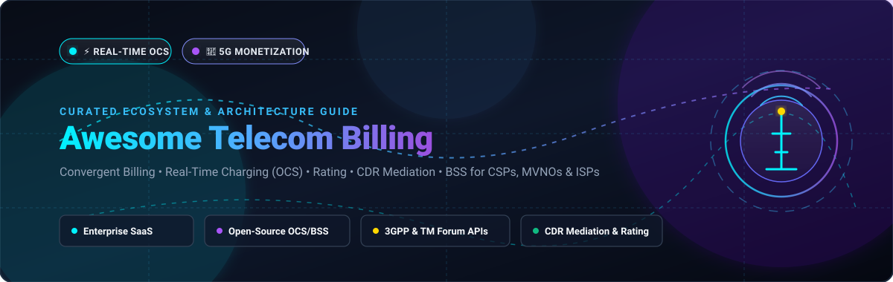

# ⚡ Awesome Telecom Billing & Real-Time Charging (OCS)

<div align="center">



<a href="https://github.com/ishandutta2007/Awesome-Awesome-Awesome"></a>
<a href="https://discord.gg/jc4xtF58Ve"></a>
<a href="https://github.com/ishandutta2007/Awesome-Telecom-Billing/stargazers"></a>
<a href="https://github.com/ishandutta2007/Awesome-Telecom-Billing/network/members"></a>
<a href="https://github.com/ishandutta2007/Awesome-Telecom-Billing/issues"></a>
<a href="https://github.com/ishandutta2007/Awesome-Telecom-Billing/blob/main/LICENSE"></a>
<a href="https://github.com/ishandutta2007/Awesome-Telecom-Billing/pulls"></a>
<a href="https://github.com/ishandutta2007"></a>

<br/>

**A curated index of enterprise SaaS platforms, open-source rating engines, real-time online charging systems (OCS), CDR mediation tools, and BSS/OSS monetization architectures for CSPs, MVNOs, ISPs, and modern cloud communications.**

*Last updated: August 2026*

</div>

---

## 📖 Overview & Ecosystem Taxonomy

Modern telecommunications billing systems manage multi-billion transaction pipelines across voice (VoLTE/VoNR), high-speed data, SMS/RCS, IoT telemetry, eSIM services, and 5G network slicing. This repository catalogs both market-leading enterprise SaaS billing platforms and production-grade open-source charging engines.

Key domains covered:
- ⚡ **Online Charging System (OCS) & 5G CHF**: Sub-millisecond balance reservation, quota authorization, and event charging over 3GPP Diameter (Gy/Ro) and HTTP/2 (Nchf) interfaces.
- ⏱️ **Real-Time Rating & Tariff Engines**: Complex dynamic rate cards, step billing, peak/off-peak rating, bundles, shared family balances, and enterprise discounts.
- 🔄 **CDR Mediation & Collection**: High-throughput ingestion, parsing (ASN.1, CSV, binary), normalization, deduplication, and aggregation of Call Detail Records from switches and gateways.
- 💳 **Billing & Revenue Management (BRM)**: Multi-currency invoicing, taxation engine integrations, ledger accounting, dunning, automated payments, and revenue assurance.
- 📱 **Digital BSS / CPQ & Customer Portals**: Self-service subscriber management, product catalogs compliant with TM Forum Open APIs, and eSIM provisioning.

---

## 📑 Table of Contents
- [🏢 SaaS & Hosted Enterprise Platforms](#-saas--hosted-enterprise-platforms)
- [💻 Open-Source GitHub Projects](#-open-source-github-projects)
- [🏗️ Architectural Blueprints & Tech Stack](#️-architectural-blueprints--tech-stack)
- [🤝 How to Contribute](#-how-to-contribute)
- [⭐ Star History](#-star-history)
- [📄 Disclaimer](#-disclaimer)

---

## 🏢 SaaS & Hosted Enterprise Platforms

The table below is sorted in descending order by company size (market capitalization, enterprise valuation, or annual revenue).

| Platform | Market Cap / Valuation / Revenue | Core Capabilities | Starting Tier Pricing | Free Tier / Trial Limits |
| :--- | :--- | :--- | :--- | :--- |
| **[Oracle Communications Billing](https://www.oracle.com/industries/communications/)** | ~$380B+ Market Cap ($53B+ Annual Revenue) | Enterprise Billing and Revenue Management (BRM) & Oracle Monetization Cloud for Tier-1 CSPs and high-volume billing pipelines. | $1,200 / month (or $0.50 per 10K Daily Transaction Units / $150/user/mo base) | 30-day Oracle Cloud Free Tier ($300 cloud credits) with guided BRM demo instance; no perpetual free tier. |
| **[Amdocs](https://www.amdocs.com/)** | ~$10.5B Market Cap ($4.9B+ Annual Revenue) | Convergent billing, real-time charging (OCS), and revenue management suite for Tier-1 and large multi-play CSPs. | $150 / user / month (~$1,800/year base user seat tier) | 30-day guided evaluation sandbox instance for testing simulated subscriber datasets; no perpetual free tier. |
| **[CSG](https://www.csgi.com/)** | ~$1.6B Market Cap ($1.17B Annual Revenue) | Customer engagement, revenue management, mediation, and convergent billing suite for CSPs and digital service providers. | $150 / user / month (~$1,800/year base license; cloud transactions starting at $0.08/unit) | 30-day proof-of-concept (PoC) sandbox trial with guided demo data upon sales request; no perpetual free tier. |
| **[Enghouse Networks](https://www.enghouse.com/)** | ~$1.5B Market Cap ($470M+ Annual Revenue) | Telecom BSS/OSS suite, mediation, interconnect billing, wholesale settlement, and network management. | $100 / user / month (~$1,200/year base seat tier; Dialogic BorderNet SBC Lite has $0 software license) | Free Lite Edition (Enghouse Dialogic BorderNet SBC Lite: $0 perpetual software license with limited concurrent sessions) or 30-day enterprise evaluation trial. |
| **[Cerillion](https://www.cerillion.com/)** | ~$650M Market Cap ($55M+ Annual Revenue) | Turnkey BSS/OSS platform and Cerillion Skyline subscription billing for telecom, IoT, and digital services. | $140 / user / month (or $450 / month starter tier for Skyline Essential) | 14-day free trial on Skyline Essential sandbox accounts with test customer and invoice limit; no perpetual free tier. |
| **[Sigma Systems](https://www.sigma-systems.com/)** | ~$650M Parent Cap (Hansen Technologies; $220M+ Revenue) | Hansen Technologies enterprise catalog, CPQ, and order-to-cash BSS components for telecommunications operators. | $50 / user / month (~$600/year starter catalog management user license) | 30-day evaluation proof-of-concept environment limited to a single sandbox catalog deployment; no perpetual free tier. |
| **[Matrixx Software](https://www.matrixx.com/)** | ~$350M Valuation ($100M+ Funding Raised) | High-throughput real-time convergent charging (OCS) and 5G digital commerce monetization platform. | $500 / month (~$6,000/year starter capacity license) | 30-day sandbox PoC environment on AWS/GCP for non-production traffic rating tests; no perpetual free tier. |
| **[Openet](https://www.openet.com/)** | ~$180M Acquisition Valuation (Amdocs; $70M+ Revenue) | Real-time policy control (PCRF/PCF), charging, and 4G/5G digital monetization engine. | $350 / user / month (~$4,200/year entry component licensing) | 14-day interactive guided demo sandbox limited to policy and charging test scenarios; no perpetual free tier. |
| **[Optiva](https://www.optiva.com/)** | ~$120M Market Valuation ($70M+ Annual Revenue) | Cloud-native BSS, real-time charging engine, and 5G/IoT monetization for digital telcos and MVNOs. | $417 / user / month (~$5,000/user/year base subscription tier) | 30-day cloud test sandbox / PoC environment limited to 1 test tenant and simulated CDR traffic; no perpetual free tier. |
| **[LogiSense](https://www.logisense.com/)** | ~$25M Est. Valuation ($8M+ Annual Revenue) | Agile usage rating, mediation, and real-time charging platform for telecom, UCaaS, and IoT. | $500 / month (Entry usage-based tier) | 30-day guided sandbox demo trial for up to 100 test subscriber accounts; no perpetual free tier. |
| **[OneBill](https://www.onebillsoftware.com/)** | ~$15M Est. Valuation (PE/Growth Backed) | All-in-one telecom billing, CPQ, subscriber lifecycle, and revenue management SaaS. | $800 / month (Starter billing tier) | 14-day full-feature sandbox free trial (limited to test accounts and simulated billing runs; no credit card required). |
| **[NTS Utility Billing](https://www.nts-billing.com/)** | ~$12M Est. Valuation / Revenue | Telecom, broadband, and multi-utility billing and subscriber management platform. | $75 / user / month (~$900/year per concurrent billing operator) | 14-day guided evaluation trial with sample billing data and simulated invoicing runs; no perpetual free tier. |
| **[Tridens Monetization](https://tridenstechnology.com/)** | ~$10M Est. Valuation / Revenue | Cloud convergent charging, rating, and telecom subscriber invoicing platform. | $349 / month (Basic tier) + 1% billed revenue | 14-day free trial sandbox with full platform access limited to 1,000 test transactions. |
| **[Togai](https://www.togai.com/)** | ~$8M Est. Valuation (Venture Backed) | Usage metering, rating engine, and real-time telecom-grade billing orchestration SaaS. | $0 / month (Pay-as-you-go starter tier; Standard from $100 / month) | Free forever plan up to 50,000 monthly events and 50 invoices; 14-day free trial on premium tiers. |

---

## 💻 Open-Source GitHub Projects

The list below features open-source billing engines, real-time OCS, CDR mediation pipelines, and 5G charging platforms, sorted in descending order by GitHub star count.

| Project | Stars | Focus & Description | Tech Stack |
| :--- | :--- | :--- | :--- |
| **[Kill Bill](https://github.com/killbill/killbill)** | [](https://github.com/killbill/killbill/stargazers) | Enterprise-grade modular subscription billing and payment processing platform with real-time invoice generation, invoice item adjustments, plugin architecture, and payment gateway integrations. | Java, OSGi, PostgreSQL / MySQL |
| **[Open5GS](https://github.com/open5gs/open5gs)** | [](https://github.com/open5gs/open5gs/stargazers) | C-language Open Source implementation of 5G Core (5GC) and EPC (4G), featuring 3GPP-compliant charging and policy architectures (PCRF / PCF / CHF / SMF charging triggers). | C, MongoDB, Meson |
| **[free5GC](https://github.com/free5gc/free5gc)** | [](https://github.com/free5gc/free5gc/stargazers) | Open-source 5G core network compliant with 3GPP Release 15/16, implementing the 5G Convergent Charging Function (CHF) and Nchf SBI interface for real-time rating and quota control. | Go, Microservices, MongoDB |
| **[CGRateS](https://github.com/cgrates/cgrates)** | [](https://github.com/cgrates/cgrates/stargazers) | High-performance, carrier-grade real-time Online/Offline Charging System (OCS) for telecom and ISP environments. Implements multi-tenancy, rating engines, CDR mediation, LCR (Least Cost Routing), fraud detection, balance reservation, and Diameter/RADIUS support. | Go, Redis, MySQL / PostgreSQL |
| **[IvozProvider](https://github.com/irontec/ivozprovider)** | [](https://github.com/irontec/ivozprovider/stargazers) | Multitenant carrier-grade telephony platform for wholesale VoIP providers and retail PBX services, featuring integrated call detail record (CDR) rating, real-time balance tracking, and billing invoice generation. | PHP, Kamailio, Asterisk, MariaDB |
| **[A2Billing](https://github.com/Star2Billing/a2billing)** | [](https://github.com/Star2Billing/a2billing/stargazers) | Established open-source telecom switch and softswitch billing engine widely adopted for VoIP termination, calling-card platforms, DID resale, wholesale carrier settlement, and rate sheet management. | PHP, Python, Asterisk, MySQL |
| **[SigScale OCS](https://github.com/sigscale/ocs)** | [](https://github.com/sigscale/ocs/stargazers) | 3GPP-compliant Online Charging System (OCS) and 3GPP AAA server implementing Diameter (Ro, Gy, Gx, Sy) and RADIUS interfaces, subscriber balance management, and real-time rating functions for CSPs. | Erlang/OTP, 3GPP Diameter, REST |
| **[BillRun](https://github.com/BillRun/system)** | [](https://github.com/BillRun/system/stargazers) | Open-source enterprise billing and revenue management system built for telecom operators and IoT service providers. Features high-volume mediation, complex CDR rating, balance management, and automated invoicing. | PHP, MongoDB, Vue.js, Docker |
| **[Ostelco Core](https://github.com/ostelco/ostelco-core)** | [](https://github.com/ostelco/ostelco-core/stargazers) | Cloud-native telecommunications engine and telco-as-a-service platform with microservices for real-time OCS charging, Diameter gateway connectors, eSIM provisioning, and streaming analytics pipelines. | Java, gRPC, PostgreSQL, Cloud-Native |
| **[Issabel Reports & CDR](https://github.com/IssabelFoundation/reports)** | [](https://github.com/IssabelFoundation/reports/stargazers) | Call Detail Record (CDR) reporting, trunk usage tracking, and rate calculation modules for VoIP PBX ecosystems. | PHP, MariaDB, Asterisk |
| **[Evren-Cell OCS](https://github.com/i2i-Interns-2024/Evren-Cell)** | [](https://github.com/i2i-Interns-2024/Evren-Cell/stargazers) | Microservices-based real-time Online Charging System prototype implementing voice, SMS, and data quota authorization with Kafka event pipelines and distributed cache management. | Java, Spring Boot, Kafka, Hazelcast |
| **[Billycom Web](https://github.com/reicolina/billycom-web)** | [](https://github.com/reicolina/billycom-web/stargazers) | Web-based telecommunications billing and CDR mediation application for VoIP resellers, interconnect carriers, and line aggregators. | PHP, MySQL, Apache |
| **[Telecom Billing System](https://github.com/PRAJWAL2108/TELECOM-BILLING-MANAGEMENT-SYSTEM)** | [](https://github.com/PRAJWAL2108/TELECOM-BILLING-MANAGEMENT-SYSTEM/stargazers) | Core telecom billing and subscriber ledger management system for customer record management and rating operations. | C / C++, File Streams |

---

## 🏗️ Architectural Blueprints & Tech Stack

```
                               ┌─────────────────────────┐
                               │   Network Core / PCEF   │
                               │  (5G UPF / PGW / IMS)   │
                               └────────────┬────────────┘
                                            │ 3GPP Ro / Gy / Nchf
                                            ▼
 ┌──────────────────────┐      ┌─────────────────────────┐      ┌──────────────────────┐
 │  Streaming Mediation │      │   Real-Time OCS / CHF   │      │  Catalog / Offer Mgmt│
 │  (Kafka / Flink CDR) │─────▶│ (CGRateS / SigScale /   │◀─────│  (TM Forum Open APIs │
 └──────────────────────┘      │  Matrixx / Optiva)      │      │   TMF620 / TMF622)   │
                               └────────────┬────────────┘      └──────────────────────┘
                                            │ Rating & Balances
                                            ▼
 ┌──────────────────────┐      ┌─────────────────────────┐      ┌──────────────────────┐
 │ Customer Self-Care   │      │ Convergent Invoicing &  │      │ Payment Gateways &   │
 │ Web / Mobile Portal  │◀─────│ Revenue Management (BRM)│─────▶│ Tax Engines (Avalara/│
 │  (eSIM / Balances)   │      │ (BillRun / Kill Bill)   │      │ Stripe / Direct Debit│
 └──────────────────────┘      └─────────────────────────┘      └──────────────────────┘
```

### Key Integration Paradigms
- ⚡ **High-Speed Rating & Quota Reservation**: Microservice-based in-memory rating using Redis or Hazelcast clusters for sub-10ms latency SLAs.
- 📡 **Diameter & SBI Protocol Stacks**: 3GPP Gy / Ro (RFC 4006 Diameter Credit Control Application) for 4G/LTE and RESTful HTTP/2 JSON (3GPP TS 32.291 Nchf) for 5G Core.
- 🔄 **Event-Driven CDR Mediation**: High-throughput Kafka and Apache Flink pipelines ingesting ASN.1, GTP', and CSV CDR files to normalize usage records before rating.
- 📊 **Observability & Revenue Assurance**: Prometheus metrics and Grafana dashboards for real-time monitoring of rated CDR throughput, leakage alerts, and billing drift.

---

## 🤝 How to Contribute

1. 🍴 Fork the repository.
2. 📝 Add or update entries in [`README.md`](README.md) following the existing table formatting and criteria.
3. 🔗 Verify that all vendor links, GitHub repositories, and pricing/star badges are functioning and accurate.
4. 🚀 Submit a Pull Request with a clear, concise summary of the changes.

---

## ⭐ Star History

[](https://star-history.dera.page/#ishandutta2007/Awesome-Telecom-Billing&type=date&legend=top-left)

---

## 📄 Disclaimer

- This is an independent, **community-curated** directory — not an endorsement of any commercial platform or open-source software.
- Telecom billing and real-time charging systems process legally binding financial transactions, consumer credit records, and taxation reporting. Always conduct rigorous testing, security audits, and financial validation before production deployments.
- Ensure all rating and charging workflows comply with regional telecommunications regulatory standards (e.g., FCC, OFCOM, BEREC, TRAI) and accounting guidelines (e.g., IFRS 15 / ASC 606).

---

<div align="center">
<b>Built with ❤️ for telecom billing architects, MVNO operators, and charging engine engineers.</b>
</div>
